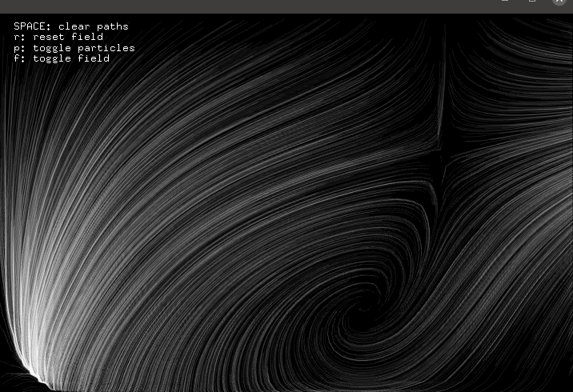
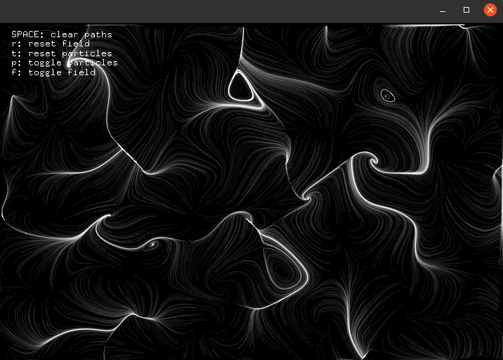
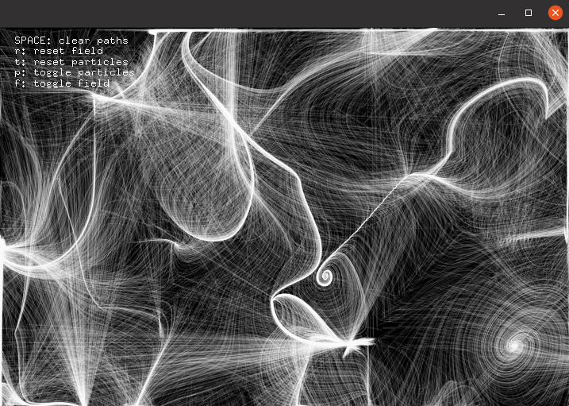

# Week 4

## EXERCISE
In class we were instructed to create a simple python web scraper using BeautifulSoup. I found out that by pressing the first non italicized non parenthized link on each wikipedia page you would get to wiki/Philosophy - or you would reach a cycle (repeated links) or dead end (no links). To showcase this I created a simple scraper that works out the "Philsophy number" of an inputted wiki page - that is the amount of links it takes to get to philosphy. The software includes support for cycles as well as dead ends. Below are some examples of the execution:


\
\
Additionally, I used `gensim` to summarise the first five paragraphs of each page to a word count of 25 * links to Philsophy. I thought it would be funny to have a really pretentious and overfleshed definition of something simple. Below is the output when I searched for pot pie:
```
Pot_Pie has 23 links to philosphy!

The term is used in North America.[2][3] Pot pies may be made with a variety of fillings including poultry, beef, seafood, or plant-based fillings, and may also differ in the types of crust.
Pot pie can be prepared in a number of ways including in a skillet over a stovetop,[7] in a baking dish in an oven,[8] or in a pie iron over a campfire.[9] There are numerous other types of pot pies including taco, Ham and brie pizza, and steak and mushroom.[10] The pie shell and crust can be made from scratch or can be fashioned from store bought pie crust or biscuit dough and includes ingredients such as butter or olive oil, flour, and shortening.[11] Once prepared and served, the pot pie leftovers can be stored in the freezer for later consumption.[12]
The source of the word "pie" may be the magpie, a "bird known for collecting odds and ends in its nest"; the connection could be that Medieval pies also contained many different animal meats, including chickens, crows, pigeons and rabbits.[2] One 1450 recipe for “grete pyes” that is suggested as support for the "magpie" etymology contained what Charles Perry called "odds and ends", including: "...beef, beef suet, capons, hens, both mallard and teal ducks, rabbits, woodcocks and large birds such as herons and storks, plus beef marrow, hard-cooked egg yolks, dates, raisins and prunes."[3]
Baking is a method of preparing food that uses  dry heat, typically in an oven, but can also be done in hot ashes, or on hot stones.
Another form of baking is the method known as en croûte (French for "in a pastry crust"), which protects the food from direct heat and seals the natural juices inside.
Ovens contain a hollow chamber and provide a means of heating the chamber in a controlled way.[1] In use since antiquity, they have been used to accomplish a wide variety of tasks requiring controlled heating.[2] Because they are used for a variety of purposes, there are many different types of ovens.
'knowledge of nature', from φύσις phýsis 'nature')[1][2][3] is the natural science that studies matter,[a] its motion and behavior through space and time, and the related entities of energy and force.[5] Physics is one of the most fundamental scientific disciplines, and its main goal is to understand how the universe behaves.[b][6][7][8]
Natural and social sciences are empirical sciences, meaning that the knowledge must be based on observable phenomena and must be capable of being verified by other researchers working under the same conditions.[2] This verifiability may well vary even within a scientific discipline[3][4]
There is disagreement,[19][20][21] however, on whether the formal sciences actually constitute a science as they do not rely on empirical evidence.[22][20] Disciplines that use existing scientific knowledge for practical purposes, such as engineering and medicine, are described as applied sciences.[23][24][25][26][27]
Though diverse models for the scientific method are available, there is in general a continuous process that includes observations about the natural world.
The process in the scientific method involves making conjectures (hypotheses), deriving predictions from them as logical consequences, and then carrying out experiments or empirical observations based on those predictions.[5][6] A hypothesis is a conjecture, based on knowledge obtained while seeking answers to the question.
Empirical evidence is the information received by means of the senses, particularly by observation and documentation of patterns and behavior through experimentation.[1] The term comes from the Greek word for experience, ἐμπειρία (empeiría).
```
\
\
I think in the future it would be cool to illustrate the output in a clear way - like a network. Also, this can be optimised using memoisaiton; saving pages it has already reached and returning their saved philosphy number plus the current one.
\


## HOMEWORK: Learning OpenFrameworks: Realtime Perlin Noise Vector Fields

I used the ofxVectorField add-on by Jeremy Rotsztain (which can be found [here](https://github.com/mantissa/ofxVectorField)).

#### Iteration 1
\
As you can see there were some unwanted straight line artefacts when the particles went off screen
\

#### Iteration 2
\
Removed this artefacts by not updating the paths when the particles left the screen.
\

#### Iteration 3
\
Added controls such that you could generate a new field, toggle rendering of particles (not seen in the images), and toggling rendering the vector field that the particles follow.
\

#### Iteration 4
\
Extended controls to allow for resetting the particles to their original positions. Added a lifetime to the particles.
\


#### Iteration 5
\
Adjusted the field generation.
\




### Video
To see a video of this progress, please click [here](https://youtu.be/sq7wbopaGDY) or on the thumbnail below.
[](http://www.youtube.com/watch?v=sq7wbopaGDY "Vector Fields")
