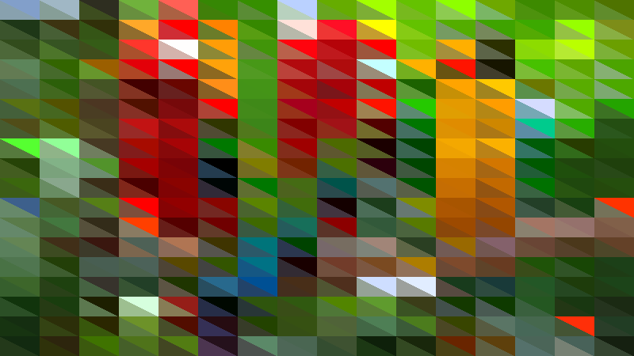

# Week 5 - Introduction to fundamental machine learning concepts with RapidLib
RapidLib is a javascript library that makes machine learning very quick and easy.

### Exercise 1
Explore how the neural network produces results based on different inputs.
\
\
A regression infers an inputs value when applied to a function - a function which is built over true data points (this "building" occurs when the model is trained). This can be viewed similarly to interpolating an (x,y) combination over a curve based on true (x,y) combinations, given the x value. Of course, inputting values outside of the dataset input range will yield undesirable results as there is no reliable data to base the output on.
### Exercise 2

\
This exercise features an example of K-Nearest Neighbour classification. Holding down a number and moving your mosue will set ground truth datapoints with classifications based on the number pressed. The output of the KNN algorithm is then illustrated using colours to represent the different discrete classes.
Try to choose a set of training examples that will draw the boundary with Class 1 on the left in green and Class 2 on the right in blue. Try and make the line as straight as possible between the two classes.
\
\

\
I found the easiest way to make the line straight was to create a mirror of the data from one side to the other with both clusters of data equidistant from the equilibrium. Note this shouldn't require many data points. There is a slight tilt in the line as I accidentally flicked a data point too far right for the green class.
\
\
Now try to make class 2 occupy the lower right quadrant.
\

\
Similarly to the previous example, this shouldn't require many datapoints. The difference here is that the data points are in each corner (in equal amounts), equidistant to the origin. Likewise, they do not need to be close or far from the boundary, as long as they are all equidistant to the origin.
### Exercise 3
This extracts Mel-Frequency Ceptrum Coefficients and uses them as input to a KNN classifier. MFCCs extract a kind of fingerprint to a piece of audio which approximates the human auditory system's response more closely than the linearly-spaced frequency bands used in the normal cepstrum
Using this MIMIC [here](https://mimicproject.com/code/3864f3e5-8263-b70e-5ef9-1037c724d4ec) I was very surprised to see how effective it was when trained on a dataset on different audio clips from youtube.
### Exercise 4
Create a training set that produces a diagonal line from one corner of the canvas to the other.
How easy is this to do? What issues do you face?
\
\
I found it quite difficult to create a straight diagonal line with the regression explorer. In theory, it is a very simple regression/interpolation task to infer to data points from one corner to the other (a straight line) - this was my tactic. However the regression in this example was obviously expecting curved data/a curved function so it approximated my data points accordingly. I could have yielded a better example had I included more data points straight along the line but it would never be perfectly straight.
\

### Exercise 5
The MIMIC [here](https://mimicproject.com/code/5d67faaa-e4c3-771a-f824-fe5c5b978ab6) was very fun to play around with. I managed to control the output which featured three parameters with just one input control.
### Exercise 6
Can you take the simple RapdLib example we created at the start and use it to take different inputs, and control different outputs?
How about using the system for controlling a 3D mesh?
\
\
For this exercise I attempted to create a basic AI for a simple paddle game. The aim is to get as many falling circles as possible moving either left or right. The user can train the model and then run it to see what score it gets. The inputs are obstacle position and player X and the output is player velocity (ie left or right). Note this is really a classification problem (two discrete classes) but I opted to use a regression to make the output seem more organic (ie with a varying velocity).
\
\
Side note: halfway through creating this using a HTML5 canvas I discovered some pretty cool and accidental artefacts with arcs. These can be seen below.
\

#### Instructions
The aim is to collect the falling circles with the paddle by moving it either left or right with the arrow keys. To train the model based on your movements press t. When you have finished recording data for the training process press t again. To evaluate how good the model is press r to run. It is worth mentioning the final result is never that good and there are many improvements to be had, I still thought it was cool though to see how quickly a model could be trained - and in real time!
You may play the game on MIMIC [here](https://mimicproject.com/code/8a3d6fe7-02ec-8402-b955-3f57bc3df419). Below are some screenshots.
\

\

## Using Numpy to compute images
For the homework I used a simple circle approximation generator and then randomly added them across the figure. Due to the approximation this resulted in predictable noisy results which I thought looked quite cool, kind of like snowflakes. The code is written such that it inverts whatever the pixel is if the circle lands over it. Essentially it is an array of booleans. I considered this made the circles blend in more.
\

\
\
I also decided to use numpy to alter an image. I wanted to turn an image into a mosaic of triangles. To do this I split the input image up into rectangles/squares and calculated the mean colour, and the mode r, g, and b. I then set the sections to the mean colour aboce the diagnonal, and the mode colour below the diagonal.
\
#### Input image

#### Mean of 50px square sections

#### Mode of 50px square sections

#### Mosaic of 50px square sections

#### Mosaic of 25px square sections

#### Mosaic of 10px square sections

#### Mosaic of 5px square sections

#### Mosaic of 50px width 25 px height sections

